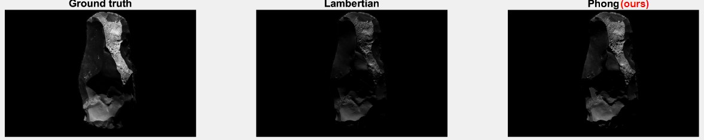

# Reflectance estimation using RTI data
This repository proposes a solution to extract information about the Bidirectional Reflectance Distribution Function (BRDF) of an object using Reflectance Transformation Imaging (RTI) data.

  

Our approach can lead to visual improvements through a more realistic reflectance. These results can improve the quality of augmented reality applications. The following figure shows an example of results (~20% MSE reduction compared to the well-established Lambertian model on this dataset):

  

## Overview

The estimation of reflectance is typically achieved through the Phong model. The traditional approach is to obtain a diffuse albedo from the Lambertian model using the RTI data. This repository aims to estimate the parameters of the Phong model (specular albedo and specular coefficients) using the same RTI data.

Find the slides from an oral presentation [here](https://docs.google.com/presentation/d/1Ubbxut1ImT0FbR_-fpLNLDvqEtQfkjquSulpFTKHjUQ/edit?usp=sharing) (in French).

## Getting Started

### RTI dataset
To estimate the reflectance parameters with the Phong model, you will need an RTI dataset. The structure of the file should be as follows:
 - `./dataset_rti/`
	 - `images/`
		 - `img000.{JPG;PNG;...}`
		 - ...
		 - `imgXYZ.{JPG;PNG;...}`
	 - `lights.txt`

The RTI images should be stored in a separate folder, and the `read_rti_data.m` script can be used to extract and format the data. The script's variables will need to be modified to match your dataset. The txt parser is designed to be flexible, but modifications may be necessary in some cases.

### Reflectance estimation with Phong model
The  `reflectance_estimation.m` script implements the Phong reflectance model for multiple light sources. It loads data from various .mat files, including images, lights, and a binary mask. The data is then reshaped and vectorized, the specular directions are computed, and a linear system is initialized. The script then solves the linear system, computes error metrics for the resulting model images, and saves the results and reshaped images to .mat files. Please update the script's paths to match your setup.

### Visualization
The `results_visualization.m` script displays and analyzes the results of the Phong reflectance model from `reflectance_estimation.m`. It loads and displays the error pixel mask, mean squared error (MSE) for both the Lambertian and Phong models, and mean absolute error (MAE) for each light for both models. The script also displays the ground truth, Lambertian and Phong model images, and MAE for each light as a heatmap. The script allows you to view the results for each light, one at a time, by pressing a button. Please update the script's paths to match your setup.

## Acknowledgments
 - [Matlab code for robust nonconvex photometric stereo](https://github.com/yqueau/robust_ps)
 - [Étude et modélisation de la réflectance de la surface d'objets réels
](https://domurado.pagesperso-orange.fr/Memoire/)

